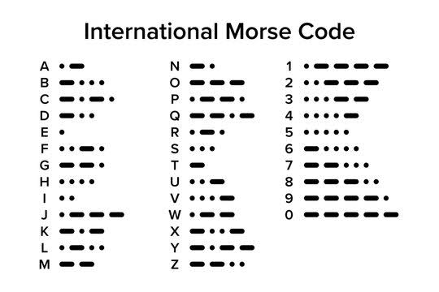

[](https://www.youtube.com/watch?v=SI557n0paVI)


# Rodar em outro computador (Windows, Linux ou macOS)

O mesmo código roda nos três sistemas. Um computador toca (emite) e o outro escuta (recebe)
pelo microfone; os dois usam os mesmos arquivos.

## Arquivos que precisam estar juntos na mesma pasta

Bits:  `receptor.py`, `decodificador_bits.py`, `paridade.py`, `detector_batidas.py`, `plataforma.py`
Morse: `receptor_morse.py`, `decodificador_morse.py`, `detector_batidas.py`, `plataforma.py`

Use a mesma versão dos arquivos nos dois computadores (os tempos de pausa precisam combinar).

## Instalação (uma vez)

Precisa de Python 3.8 ou mais novo.

**Windows** (PowerShell ou cmd)
```
py -m venv .venv
.venv\Scripts\activate
pip install -r requirements.txt
```

**Linux** (Ubuntu/Debian)
```
sudo apt install libportaudio2 python3-venv
python3 -m venv .venv
source .venv/bin/activate
pip install -r requirements.txt
```

**macOS**
```
python3 -m venv .venv
source .venv/bin/activate
pip install -r requirements.txt
```
Na primeira execução o macOS pede permissão de microfone para o Terminal: aceite. Se negar por
engano, libere em Ajustes do Sistema > Privacidade e Segurança > Microfone.

Em cada terminal novo, ative o ambiente de novo (`.venv\Scripts\activate` ou `source .venv/bin/activate`).

## Rodar

```
python receptor.py            # bits
python receptor_morse.py      # Morse
```

Fique em silêncio durante os 2 s de calibração. Ctrl+C encerra a escuta e abre o menu final
(`r` reemite, `e` digita um texto e emite, `b` digita bits e emite, `s` sai).

## Só emitir (sem escutar)

```
python receptor.py --emitir
python receptor_morse.py --emitir
```
Não usa o microfone e abre direto o menu de emissão:
- `e` = digita um texto e ele é emitido (bits: cada letra vira 8 bits + 1 de paridade; Morse: letras em Morse)
- `b` = (só no programa de bits) digita bits em grupos de 8, por exemplo `01001000 01101001`; a paridade é
  adicionada sozinha
- `r` = emite de novo o que foi recebido ou digitado por último
- `s` = sai

O mesmo menu aparece depois do Ctrl+C na escuta. Cada bit ou símbolo toca o seu som: 1 bipe grave e
longo (bit 0 / ponto) ou 2 bipes agudos e curtos (bit 1 / traço), que o outro computador conta como 1 ou 2 batidas.

## Escolher microfone e alto-falante

```
python receptor.py --listar
python receptor.py --entrada 1 --saida 3
```
O número vem da lista. Sem as opções, usa o microfone e o alto-falante padrão do sistema.

## Para dois computadores se entenderem

1. No computador que vai ler: rode o programa e espere "Escutando o microfone...".
2. No computador que vai enviar: encerre com Ctrl+C e use `r` (ou `e` no Morse).
3. Deixe o alto-falante de um perto do microfone do outro, com volume médio/alto e o ambiente quieto.
4. Se não ler nada, rode o leitor com `MOSTRAR_NIVEIS = True` (topo do arquivo) e confira se o nível
   passa do limiar quando o outro toca. Se não passar, aumente o volume ou aproxime os computadores.

## Problemas comuns

- **Nada é detectado, limiar baixíssimo**: o sistema pode estar bloqueando o microfone (permissão) ou
  usando o dispositivo errado. Use `--listar`. O programa avisa quando o microfone entrega só silêncio.
- **Cancelamento de ruído / "isolamento de voz"** (Windows, macOS, alguns notebooks) pode apagar os
  bipes. Desligue nas configurações de som do microfone.
- **`PortAudio library not found`** (Linux): `sudo apt install libportaudio2`.
- **`Invalid sample rate`**: o programa já tenta 48000 Hz sozinho; se ainda falhar, escolha outro
  dispositivo com `--entrada`.
- **Símbolos virando `?` ou quadrados**: use Windows Terminal, cmd ou PowerShell comuns (não o ISE).

# Software-Camada-Física

## As sete camadas do modelo ISO/OSI

O **modelo ISO/OSI** é um modelo de referência utilizado para compreender como ocorre a comunicação entre dispositivos em uma rede. Ele é dividido em 7 camadas, cada uma responsável por funções específicas durante a comunicação.

### 1. Camada Física

A **camada física** do modelo ISO/OSI é responsável pela transmissão de dados brutos, convertendo os bits em sinais adequados ao meio de comunicação. Quando o meio é elétrico, a camada converte os bits em sinais elétricos que serão transmitidos pelo cabo; e se for óptico, transforma-se em sinais luminosos.

---

### 2. Camada de Enlace

A **camada de enlace** é responsável pela comunicação entre dispositivos conectados ao mesmo enlace, utilizando a camada física para transmitir os dados na forma de quadros (frames).

Entre suas principais funções estão:

* **Controle de acesso ao meio físico**;
* **Detecção de erros**;
* **Endereçamento físico**;
* **Controle de fluxo**, evitando que um host mais rápido envie informações em uma velocidade maior do que um host mais lento consegue processar.

---

### 3. Camada de Rede

A **camada de rede** é responsável pelo endereçamento, roteamento e encaminhamento dos dados em uma rede ou entre várias redes conectadas. Ela determina como os pacotes serão encaminhados desde a origem até o destino, além de poder estar relacionada ao controle de congestionamento e à qualidade de serviço.

---

### 4. Camada de Transporte

A **camada de transporte** é responsável pela comunicação fim a fim entre aplicações, podendo oferecer uma comunicação orientada ou não orientada à conexão.

* **Orientada à conexão**

Estabelece uma conexão antes da transmissão dos dados e pode utilizar mecanismos de confirmação, controle de erros, retransmissão e controle de fluxo.

Um exemplo é o TCP (Transmission Control Protocol).

* **Não orientada à conexão**

Não estabelece uma conexão antes da transmissão e não oferece garantias de entrega, ordem ou retransmissão dos dados.

Um exemplo é o UDP (User Datagram Protocol).

---

### 5. Camada de Sessão

A **camada de sessão** gerencia o início, a manutenção e o término das sessões entre aplicações, além de tratar mecanismos relacionados ao controle e à sincronização da comunicação.

Segundo Tanenbaum, essa camada estabelece sessões entre usuários de diferentes máquinas e oferece serviços como:

* **Controle de diálogo:** controla quem pode transmitir em determinado momento;
* **Gerenciamento de token:** impede que as duas partes executem determinadas operações simultaneamente;
* **Sincronização:** estabelece pontos de sincronização durante a transmissão, permitindo que, em caso de falha, a comunicação possa ser retomada a partir de um ponto em que parou.

---

### 6. Camada de Apresentação

A **camada de apresentação**, também chamada de camada de tradução, é responsável pela representação dos dados, tratando de sua sintaxe e semântica. Ela permite a tradução entre diferentes formatos de dados e pode realizar funções como:

* Codificação;
* Compressão;
* Criptografia;
* Conversão de formatos.

Dessa forma, possibilita que as informações sejam representadas de maneira adequada para as aplicações.

---

### 7. Camada de Aplicação

A **camada de aplicação** é a mais próxima das aplicações utilizadas pelos usuários. Ela fornece serviços de rede diretamente aos programas e contém protocolos utilizados pelas aplicações para realizar diferentes tipos de comunicação.

Alguns exemplos de protocolos associados à camada de aplicação são:

* **HTTP:** utilizado para acesso a páginas e recursos da Web;
* **DNS:** utilizado para resolução de nomes de domínio;
* **SMTP:** utilizado para envio de e-mails.

---

## Camada Física do Modelo ISO/OSI

### 1. Camada Física: suas funções

A **Camada Física** é a **camada 1 do modelo OSI**, responsável pela transmissão e recepção de **fluxos de bits brutos** por meio de um meio físico. Ela define características elétricas, ópticas ou de radiofrequência dos sinais, como níveis de tensão, temporização, modulação e especificações de conectores.

A camada física não trabalha com o significado ou a organização dos bits. Sua função está relacionada à conversão entre os valores digitais `0` e `1` e os sinais físicos que percorrem fios, fibras ópticas ou o ar.

#### Principais funções

* **Codificação de linha:** técnicas como Manchester, 8b/10b e 4D-PAM5 mapeiam bits em níveis de sinal ou transições.
* **Multiplexação:** técnicas como FDM(Multiplexação por Divisão de Frequência) e WDM(Multiplexação por Divisão de Comprimento de Onda), permitem transportar diferentes canais utilizando o mesmo meio.
* **Transmissão física:** utiliza meios como par trançado, cabo coaxial, fibra óptica e rádio.
* **Conectores e transceptores:** dispositivos como módulos SFP fazem a interface entre os equipamentos e o meio físico.
* **Padronização:** especificações são definidas por organizações como IEEE, ITU e 3GPP.

#### Exemplos de padrões

| Padrão      | Aplicação                     |
| ----------- | ----------------------------- |
| IEEE 802.3  | Ethernet                      |
| IEEE 802.11 | Wi-Fi                         |
| IEEE 802.15 | Bluetooth e Zigbee            |
| 3GPP LTE    | Comunicação móvel 4G          |
| 5G NR       | Comunicação móvel 5G          |
| USB         | Interconexão de curto alcance |
| HDMI        | Transmissão de áudio e vídeo  |
| PCIe        | Comunicação entre componentes |
| DisplayPort | Transmissão de áudio e vídeo  |

Esses padrões permitem a comunicação entre equipamentos de diferentes fabricantes e especificam características relacionadas à sinalização e à interface física.

#### Aplicações

A Camada Física está presente em diversas tecnologias, como:

* Redes locais Ethernet e Wi-Fi;
* Telefonia celular 4G e 5G;
* Fibra óptica de longa distância;
* Redes industriais;
* Sistemas de comunicação via satélite;
* Sistemas de radar.

---

### 2. Sinais analógicos e digitais

#### Sinais analógicos

Em uma transmissão analógica, o sinal pode sofrer degradação conforme percorre o meio físico. Quando o sinal enfraquece, torna-se mais difícil diferenciá-lo do ruído.

Um problema importante é que, ao amplificar um sinal analógico, o ruído presente nele também é amplificado. Com o aumento da distância, isso pode comprometer a qualidade da comunicação.

#### Sinais digitais

Os sinais digitais utilizam dois estados principais, representados por `0` e `1`. Essa característica facilita a separação entre o sinal e o ruído.

Por isso, sistemas digitais apresentam maior facilidade para recuperar a informação transmitida e foram amplamente utilizados na evolução dos sistemas de comunicação.

#### Conversão analógico → digital

Um exemplo é o PCM (Modulação por Código de Pulso), utilizado na codificação de voz. O processo de conversão possui as seguintes etapas:

```text
Sinal analógico
      ↓
Filtragem
      ↓
Amostragem (PAM)
      ↓
Quantização
      ↓
Codificação
      ↓
Dados digitais
```

Na origem existe um conversor A/D (analógico-digital). No destino, um conversor D/A (digital-analógico) para reconstruir o sinal.

---

### 3. Largura de banda

A largura de banda  representa a faixa de frequências que pode ser utilizada por um sistema de comunicação.

#### Voz

A maior parte da energia da fala está aproximadamente entre 200–300 Hz e 2.700–2.800 Hz. O material também apresenta uma largura de banda de 4.000 Hz para comunicação de voz padrão.

#### Filtragem

A filtragem remove componentes de frequência mais alta do sinal e facilita as etapas seguintes da conversão. Um dos objetivos do filtro limitador de banda é evitar a sobreposição espectral causada por uma amostragem inadequada, gerando o aliasing(falseamento do sinal), que ocorre quando as amostras coletadas são baixas em comparação com a velocidade da variação do sinal origial.

#### Largura de banda e meio físico

O meio utilizado na transmissão influencia diretamente as características da comunicação. Como nas aplicações seguintes:

* **Fibra monomodo:** pode alcançar dezenas de quilômetros com taxas superiores a 100 Gbps, trasmite apenas um único feixe ou modo de luz por vez.
* **Cat 6A:** suporta Ethernet de 10 Gbps em distâncias de até 100 metros.

---

### 4. Taxa de amostragem

A amostragem consiste em representar um sinal analógico por meio de amostras obtidas em determinados intervalos de tempo. No processo apresentado, a amostragem utiliza PAM (PModulação por Amplitude de Pulso), no qual os dados são codificados na aplitude de uma série de pulsos elétricos ou ópticos em intervalos de tempo regulares.

#### Critério de Nyquist

Para que um sinal possa ser reconstruído corretamente, a frequência de amostragem deve ser superior ao dobro da largura de banda do sinal:

```text
Fs > 2 × BW
```

Onde:

* `Fs` = frequência de amostragem;
* `BW` = largura de banda do sinal.

#### Aliasing

O aliasing ocorre quando a frequência de amostragem é insuficiente:

```text
Fs < 2 × BW
```

Nesse caso, ocorre sobreposição entre os componentes espectrais das amostras e do sinal de entrada. O resultado pode ser um sinal falso, que não corresponde ao sinal original.


### 5. Processamento e Digitalização de Sinais

Na camada física a digitalização pe o primeiro passo para se ter acesso aos sinais analógicos, pelo metódo de modulação de pulso que separa o sinal analógico em formas que podem ser entendidas pelos componentes discretos nos formatos de 0s e 1s.


---

#### Quantização

A quantização transforma cada amostra analógica em um valor discreto. Na quantização uniforme, os intervalos possuem espaçamento igual dentro da faixa dinâmica. Cada amostra é associada ao intervalo que apresenta a amplitude mais próxima.

De forma simplificada:

```text
Sinal analógico
      ↓
   Amostragem
      ↓
   Quantização
      ↓
Valor discreto
      ↓
 Código binário
```
PCM é o processo completo que executa os passos acima, transformando cada amostra final do sinal em uma palavra binária está


### 6. Otimizações de Banda e Codificação de Fonte

Após gerar os bits iniciais, a Camada Física aplica técnicas para reduzir a taxa de transmissão necessária (bits por segundo), driblando as limitações de capacidade física do meio e diminuindo o ruído de quantização.


#### Companding
A otimização logarítmica da faixa dinânmica, combate o ruído de quantização alterando para o formato não uniforme. Sendi formada pela junção das palavras:

* **Compressão**, realizada na origem, ntes de o sinal analógico ser convertido em digital, ele passa por um circuito ou algoritmo que comprime a faixa dinâmica.  Dessa forma, os sons de baixa intensidade são amplificados, enquanto os sons de alta intensidade são atenuados ou mantidos estáveis.;
* **Expansão**, realizada no destino, após receber o sinal digitalizado e convertê-lo de volta para o analógico, o receptor faz o processo inverso,aplica uma expansão matemática para restaurar os volumes originais do sinal.

---

#### DPCM

O DPCM (Otimização por Diferencial Físico) funciona de maneira semelhante ao PCM, porém transmite a diferença entre a amostra atual e a amostra anterior, em vez de transmitir a amostra completa.


```text
Amostra atual
      ↓
   Diferença
      ↓
 Quantização
      ↓
 Codificação
      ↓
 Transmissão
```

O sistema utiliza um preditor, que mantém uma amostra, e um diferenciador, responsável pelo cálculo da diferença. O DPCM pode reduzir a taxa para até 48 kbps. Uma limitação apresentada é que a quantização uniforme da diferença pode resultar em qualidade diferente para sinais de diferentes amplitudes.

---

#### ADPCM

O ADPCM (Otimização por Diferencial Adaptativo), definido no padrão ITU-T G.726,, utiliza adaptação dos níveis de quantização de acordo com o tamanho do sinal de diferença. Apresenta redução da taxa para 23 kbps e possui adaptação do quantizador em tempo real.

---
### 7. Modulação Digital e Transmissão no Meio Físico
Após a otimização dos bits, a camada física deve alterar as características de uma onda pafa representar fisicamente esses bits no meio de transmissão.

#### Modulação em Banda Base
* **PAM**: Modula a amplitude de um trem de pulsos elétricos puros, serve de base para tecnologias de cabo.

#### Modulação em Banda Passante
Utilizada em canais de rádio, cabos coaxiais, ou fibra ópticas através de alterações em ondas senoidais:

* **ASK**: Utiliza variações de amplitude da onda portadora.
* **PSK**: Utiliza variações de fase da onda portadora.
* **QAM**: Utiliza variações combinadas de amplitude e fase simultaneamente.

---
### 8. Ruído

O ruído é qualquer interferência que prejudique a representação ou recuperação do sinal transmitido.

#### Ruído de quantização

O ruído de quantização surge devido à diferença entre o valor real da amostra e o intervalo de quantização ao qual ela foi associada. Quanto maior esse ruído, maior a degradação da qualidade do sinal.

#### SNR — Relação sinal-ruído 

A SNR (Signal-to-Noise Ratio) representa a relação entre a intensidade do sinal e a intensidade do ruído.

A fórmula apresentada é:

```text
S/N = 20 × log₁₀(Vs / Vn)
```

Onde:

* `Vs` = tensão do sinal;
* `Vn` = tensão do ruído.

A SNR normalmente é expressa em decibéis (dB). Quanto maior a SNR, melhor a qualidade do sinal de voz.

#### Quantização uniforme

Na quantização uniforme, os intervalos possuem o mesmo tamanho em toda a faixa dinâmica. Isso produz uma SNR menor para sinais fracos e maior para sinais fortes. Como grande parte da voz apresenta níveis baixos, essa característica pode ser ineficiente.

#### Companding como solução

O companding utiliza compressão logarítmica para fazer o ruído de quantização acompanhar o nível do sinal, mantendo uma SNR mais uniforme na faixa dinâmica.

---

### 9. Ruído e meio físico

O meio físico utilizado na comunicação impõe limitações relacionadas à atenuação e ao ruído. No caso de sinais analógicos, o enfraquecimento do sinal torna mais difícil separá-lo do ruído, e a amplificação também amplifica o ruído. O aliasing também pode ser considerado um problema relacionado ao processo de transmissão e conversão, ocorrendo quando a taxa de amostragem é inadequada.

---

## Primeiro Método 

Um conversor analógico digital (ADC) é utilizado para medir um sinal do mundo real(meio físico), e transforma-lo em uma representação digital do sinal. O conversor compara amostras da tensão de entrada do meio analógio(através dos sons) para uma tensão de referência conhecida pelo conversor, e em seguida, reproduz uma representação digital (em binário) dessa entrada analógica. 

O ADC produz o error de quantização, que consiste na diferença entre o sinal analógico real e o valor digital que o conversor consegue representar, uma vez que o conversor precisa "arrendondar" o valor real para o nível dital mais próximo, e a diferença é perdida e serve como um ruído. Esse erro ocorre porque no meio físico há infinitos números de tensões para um sinal analógico, enquanto para para os códigos digitais há um número finito(0s e 1s).

Nessa conversão, o princípio de Nyquist afirma a que as amostras devem ser no mínimo o dobro da largura de banda máxima do sinal analógico que está sendo convertida, a fim de que o sinal seja reproduzido com precisão. A taxa de amostragem é o número de amostras colhidas por segundo, as unidades para a taxa de amostragem são amostras por segundo (sps) ou Hertz (Hz). Taxas de amostragem mais altas normalmente vêm ao custo de velocidades mais lentas e maior consumo de energia.


## Segundo Método - Código Morse 

O código morse é uma forma de comunição que ainda é muito utilizado entre os usuários de rádio amador por causa de suas vantagens únicas, é composto por pontos, traços e espaços que representam letras, números e sinais de pontuação aplamente utilizado por governos e militares. Esse sistema permite a transmissão de mensagens à distância, por fio ou rádio, através de sons de longa e curta duração.



O processo pode ser representado da seguinte forma:

```text
Som / voz
   ↓
Microfone
   ↓
Sinal elétrico
   ↓
Processamento / interpretação do som
   ↓
Texto ou caractere identificado
   ↓
Codificação Morse
   ↓
Pontos (·) e traços (−)
   ↓
Sinal físico
   ↓
Transmissão
```
Na transmissão, esses pontos e traços são convertidos em sinais físicos que podem ser transformados pelo meio de comunicação. Na pespectiva da Camada Física, o ponto de mais importância é a transformação dos símbolos do código morse  em sinais capazes de atravessar um meio de trasmissão. O receptor realiza realiza o inverso, identificando o sinal recebido e juntando os pontos e traços para recuperar a mensagem original.

### Explicação dos Arquivos do Código Morse
O programa está separdo por arquivos que possuem diferentes funcionalidades, que juntos podem captar batidas pelo microfone, identificar se os sons recebidos são pontos ou traços, converter os sinais em letras e palavras e emitir batidas em áudio para outros computadores.

#### Arquivo *decodificador_morse*
**Código Caractere** 

* Permite que a criação de um dicionário que contém uma tabela de morse para os símbolos e que faz o caminho inverso também.

**Função ***texto_para_morse*

* Remove acetuação das palavras;
* Converte as letras para maiúsculas;
* Identifica espaços no texto;
* Converte os caracteres;
* Identifica os caracteres que não estão na lista, e não serã convertidos;

**Clase *DecodificadorMorse***
È responsável por configuara os tempos usados no processamento
* *duração_bloco*: duração de cada bloco de aúdio;
* *silencio_simbolo_s*: silêncio necessaŕio para satisfazer a um ponto ou traço;
* *silencio_letra_s*: silêncio necessário para fechar uma letra;

**Método *reiniciar***
Descarta tudo o que estava sendo montado , icluindo as batidas, tempo de silêncio, o código, indicação de símbolo inválido e o controle de separação entre as palavras. Permite que uma nova mensagem seja reeniciada sem interferência da gerada anteriormente.

**Método *processar_bloco***
Capta o resultado da detecção de áudio e decide o significado das batidas.

* 1. Conta as batidas;
* 2. Indetifica se é ponto ou traço;
* 3. Finaliza letra;
* 4. Identifica o espaço;
## Detecção de erros

### Paridade Par
Os bits de paridade desempenham um papel importante detecção de erros nas trasmissões de dados, é um método relativamente simples, que ajuda a identificar a integridade dos dados à medida que se movem de um lugar para o outro, ao adicionar um nono bit à sequência de bits de dados. Se o valor do bit de paridade não corresponder à paridade esperada, isso sinalizará um erro à determinada sequência.

Os bits de paridade não são responsaveis por resolver os erros encontrados, apens indicam sua presença. São importantes pois no meio da comunicação digital, mesmo os erros pequenos podem levar a grandes problemas, essa detecção é particularmente importante para dados trasnmitidos à loga distância e meio sem fio.

No arquivo *detector_batidas*, a função *calcular_rms()* é utilizada para calcular o nível de energia reproduxido em cada bloco de áudio, dessa forma identica se foi detectado uma batida. O primeiro passo da execução se da por meio da calibraçãi do ruído ambiente, e em seguida estabelece um limiar mínimo de detecção do ruído, se o som produzido for aleḿ desse limiar, o progrma reconhece como uma batida que será processada.

No arquivo *decodificador_bits*, o sistema interpreta a quantidade de batidas como:
* **1 batida: Zero( 0 )**;
* **2 batitas: Um( 1 )**;

Mais de duas batidas não são lidas pelo sistema e são identificadas como um erro; porém esse meio de detecção de erros não é totalmente eficiênte, pois consegue filtrar determinadas entradas inválidas, mas não consegue identificar todos os erros posíveis.


### Detecção de Erro no Código Morse
A detecção de erros em código morse tradicionalmente não utiliza mecanismos formais, como paridadem checksun ou CRC. A identificação de erros se dá pela detecção de batitas por limiar de energia RMS (raiz quadrática média), é uma medida estátistica que quantifica a magnitude de um sinal váriavel. Amplamente utilizado na navegação inercial(clacula a velocidade, posição e orientação de objetos a partir de sensores), para descrever descrever o ruído do sensor, a instabilidade e qualidade geral das medições inerciais. O RMS expressa a potência efetiva de um sinal extraindo a média dos valores quadrados.

No arquivo *detector_batidas*, a função *calcular_rms()* é utilizada para calcular o nível de energia reproduxido em cada bloco de áudio, dessa forma identica se foi detectado uma batida. O primeiro passo da execução se da por meio da calibraçãi do ruído ambiente, e em seguida estabelece um limiar mínimo de detecção do ruído, se o som produzido for aleḿ desse limiar, o progrma reconhce como uma batida que será processada.

No arquivo *decodificador_morse*, o sistema interpreta a quantidade de batidas como:
* **1 batida: ponto( . )**;
* **2 batitas: traço( -- )**;

Mais de duas batidas não são lidas pelo sistema e são identificadas como um erro; porém esse meio de detecção de erros não é totalmente eficiênte, pois consegue filtrar determinadas entradas inválidas, mas não consegue identificar todos os erros posíveis.


## Explicação dos códigos utilizado nos métodos 

O objetivo foi representar o comportamento da Camada Física do modelo ISO/OSI, simulando o processo de transmissão, recepção e interpretação de sinais. Nesse contexto, o projeto utiliza um meio de transmissão responsável por transportar os sinais até a camada física, onde são recebidos e interpretados.

Para ambos os métodos, o meio de transmissão escolhido foi o meio sonoro. Dessa forma, as mensagens são transmitidas por meio de sinais sonoros, que funcionam como uma representação do meio responsável pelo transporte das informações. Em um dos métodos, os sinais são interpretados como informações binárias, enquanto no outro são traduzidos para o código Morse. Assim, ambos os métodos simulam o comportamento de um meio de transmissão que transporta os sinais entre os computadores.

Após a transmissão, a Camada Física recebe os sinais para que possam ser processados pela máquina. No projeto, essa etapa foi representada pelos receptores, responsáveis por captar os sinais enviados por meio do microfone dos computadores, estabelecendo uma relação direta com o hardware de áudio. Para realizar essa comunicação, foram utilizadas diferentes bibliotecas, sendo uma das principais a SoundDevice, responsável pela reprodução e captura dos sinais de áudio.

A terceira etapa é composta pelos decodificadores, responsáveis por interpretar os sinais recebidos e convertê-los para a representação correspondente. Cada método possui seu próprio decodificador. No método binário, uma batida representa o valor 0 e duas batidas representam o valor 1. No método Morse, uma batida representa um ponto (.) e duas batidas representam um traço (-). Como forma de identificar sinais inválidos, três ou mais batidas consecutivas não são consideradas como um sinal válido. No método binário, também é utilizado o bit de paridade como mecanismo de detecção de erros.

Dessa forma, o projeto representa, de maneira simplificada, as etapas de transmissão, recepção e interpretação de sinais, relacionando o funcionamento dos métodos implementados aos conceitos da Camada Física do modelo ISO/OSI.

## Desafios, Problemas e Soluções

Nosso problema dentro do trabalho foi muito com ruídos externos então teriamos que estar em silêncio absoluto para que passássemos a informação de um computador para outro, além de que muitas vezes se o volume fosse muito alto o som emitia eco e o outro computador lia outra mensagem diferente da original. Alguma vezes o computador receptor não escutava outro computador.

## Declaração de Uso de Inteligência Artificial
No arquivo *README.md* a inteligêcia artificial foi utilizada de forma a assegurar que o que foi escrito estava de acordo com as informações verídicas relacionadas à camada física, assim como para geração de bibliografia a fim de facilitar o encontro de matérias dos assuntos abordados que normalmente se encontravam na lígua inglesa, assim como na correção de texto feita após escrita manual por um dos integrantes do grupo, 

A inteligência artificial foi altamente utilizada para geração dos códigos contidos no projeto, todas suas classes, métodos e funções no geral foram feitas pela IA, apenas algumas variáveis foram trocadas para se adequar às especificações descritas pelo professor.